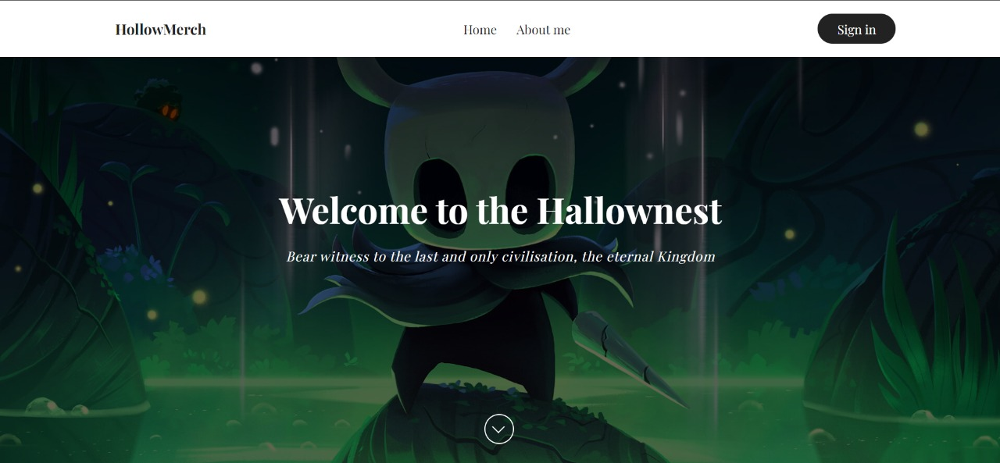

# HollowMerch

HollowMerch is a stylish e-commerce website designed for fans of the game Hollow Knight. This project was developed as a part of a university course to apply and enhance my skills in web development. The website offers a variety of Hollow Knight-themed merchandise, including clothing, action figures, toys, vinyl records, and other collectibles.

## Purpose

The primary goal of HollowMerch was to provide an engaging and easy-to-navigate platform for Hollow Knight fans to explore and purchase their favorite game-related products. This project also served as a practical application of the web development technologies learned during my course.

## Key Features

- **Intuitive Navigation**: A user-friendly navigation bar with direct links to the main sections of the site, including Home, About, Login, and different product categories.
- **Dynamic Content**: JavaScript-enhanced scrolling effects and interactive elements that provide a seamless browsing experience.
- **Product Catalogs**: Dedicated pages for different product categories, such as Clothing, Figures, and Other Merchandise, allowing users to easily find and explore various items.
- **User Authentication**: Secure registration and login forms for a personalized shopping experience.

## Design Highlights

- **Minimalistic and Thematic Style**: The website features a minimalistic design stylized to match the palette and aesthetic of the game Hollow Knight.
- **Responsive Layout**: The design is optimized for both desktop and mobile devices, ensuring a consistent user experience across platforms.

## Technologies Used

- **HTML**: Structuring the content and layout of the website.
- **CSS**: Styling the website to create an immersive Hollow Knight-themed experience.
- **JavaScript**: Adding interactive features, such as scrolling effects and content updates, to enhance user engagement.

## How to Access

- **Live Demo**: Visit the live site [here](https://supsaiyan.github.io/HollowMerch/).
- **Source Code**: Explore the code and contribute on GitHub [here](https://github.com/Supsaiyan/HollowMerch).

## Learning Experience

This project was developed as part of a university course in web development. It provided an excellent opportunity to apply theoretical knowledge in a practical setting and to work with real-world web development tools and techniques.

## Contact

For any questions or suggestions, feel free to reach out:
- **Email**: [supsx1yxn@gmail.com](mailto:supsx1yxn@gmail.com)
